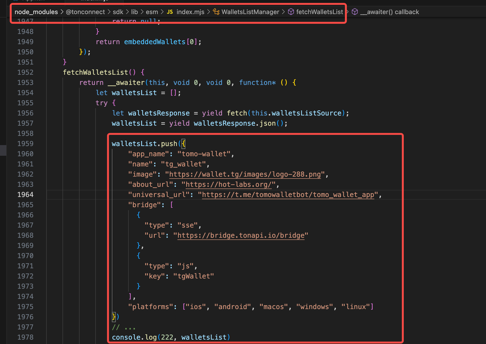

## ton-connect-test

- 拉取仓库代码：https://github.com/lxk1080/ton-connect-test
- 要调试的内容：

- 修改之后，执行：
  - npm run build
  - git add .
  - git commit -m ‘chore: update code’

- 因为dist文件夹已经通过vercel部署过，所以只要提交代码到 github，就会自动部署了

- 部署后的链接：https://ton-connect-test.vercel.app/

- 到 tg 的正式环境，把这个链接设置为自己bot的`菜单按钮链接`即可开始调试

- tg-wallet 项目地址：https://github.com/FansTech/tgbot_app

- 关于 tg-wallet，可以咨询 `tg-bot-wallet 研发组` 这个群
